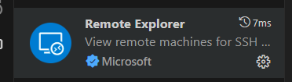
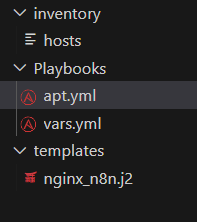

# Azure n8n Infrastructure Project

A personal project to learn and master Azure Public Cloud services by building a robust, secure, and scalable infrastructure for running n8n. This project begins with deploying an Ubuntu VM running n8n with a reverse proxy and Certbot, then extends into multiple layers such as network security, Azure Application Gateway, Azure Entra ID integration, Azure PostgreSQL migration, and high-availability testing.

## Table of Contents

- [Overview & Objectives](#overview--objectives)
- [Project Goals](#project-goals)
- [Key Features](#key-features)
- [Architecture & Components](#architecture--components)
- [Getting Started](#getting-started)
  - [Prerequisites](#prerequisites)
  - [Setting Up Your Local Environment](#setting-up-your-local-environment)
- [Deployment Instructions](#deployment-instructions)
  - [Infrastructure Deployment](#infrastructure-deployment)
  - [N8N Deployment](#n8n-depoyment)
- [Roadmap & Milestones](#roadmap--milestones)

---

## Overview & Objectives

This project is designed as a step-by-step exploration into the Azure ecosystem. It starts with a secure and functional n8n deployment on an Ubuntu Virtual Machine and incrementally builds a solid infrastructure. The primary objectives are to:

- **Establish a secure and resilient foundation:** Deploying a well-secured VM with minimal exposure.
- **Automate infrastructure provisioning:** Using Terraform for a reproducible and version-controlled Azure environment.
- **Expand functionality over time:** Integrating additional Azure services (such as Application Gateway, Azure Entra ID, and Azure PostgreSQL) and implementing high availability to meet evolving business needs.

---

## Project Goals

1. **Backend Security & Resilience**
   - **Deploy Ubuntu VM with n8n:** Set up a secure environment for running the n8n workflow automation tool.
   - **Enhance security:** Implement strict Network Security Group (NSG) rules, OS-level firewall configurations, and restrict SSH access to only your trusted public IP.

2. **Infrastructure as Code (IaC)**
   - **Terraform-based provisioning:** Automate the creation of Resource Groups, Virtual Networks (VNets), Subnets, VMs, NSGs, Public IPs, and more.
   - **Version control:** Maintain the entire infrastructure code within GitHub to enable systematic tracking and branching.

3. **Feature Enhancements**
   - **Application Gateway / Web Application Firewall:** Secure and balance incoming traffic.
   - **Azure Entra ID Integration:** Connect the VM to Azure's identity service for centralized identity and access management.
   - **Managed Database Migration:** Transition from the local SQLite database (used by n8n) to an Azure PostgreSQL instance.
   - **High Availability & Scalability:** Implement redundant architectures and load balancing to ensure mission-critical reliability.

4. **Continuous Learning & Improvement**
   - **Documentation & automation:** Keep detailed guides and architecture diagrams updated.
   - **Iterative enhancements:** Experiment with new Azure features and integrate them into the project.

---

## Architecture & Components


- **Azure Virtual Network (VNet):**  
  Provides an isolated, private networking space for all resources.

- **Subnets & Gateway Subnet:**  
  The main subnet hosts your VMs, while a dedicated gateway subnet is reserved for future VPN, Application Gateway, or other perimeter services.

- **Ubuntu Virtual Machine:**  
  Runs n8n and serves as the core of your infrastructure with added security and performance tuning.

- **Network Security Group (NSG):**  
  Implements network-level security by allowing only necessary ports (e.g., 22 for SSH and 443 for HTTPS).

-1.png>)
- **Reverse Proxy & Certbot:**  
  Manages and secures incoming HTTPS traffic, handling SSL/TLS certificate issuance and renewals.

- **Future Components:**
  - **Application Gateway / Web Application Firewall:**  
    Provides additional security by inspecting and balancing traffic.
  - **Azure Entra ID:**  
    Enables centralized identity and access management.
  - **Azure PostgreSQL:**  
    Offers a managed database service for a more robust data backend.
  - **High-Availability Setup:**  
    Deploys redundant systems and load balancers to ensure continuous service.

---

## Getting Started

### Prerequisites

- **Azure CLI:** For managing and deploying Azure resources.
- **Terraform:** To execute Infrastructure as Code.
- **Git:** For cloning and managing the repository.
- **Basic Networking Knowledge:** Understanding firewall rules and NSGs.
- **SSH Client:** For secure access to your Ubuntu VM.

### Setting Up Your Local Environment

1.**Install Dependencies:**

 1. Install Git & Configuring Git and GitHub:
      a.Install Git:
         - **Windows/Mac:**  
            Download and run the installer from [git-scm.com/downloads](https://git-scm.com/downloads).
          
          - **Linux:**  
            Use your package manager (for example, on Ubuntu/Debian run):
            ```bash
            sudo apt update
            sudo apt install git
            ```
    
      b. Configure Git:
    
          Set your global username and email (these details will be used in your commit messages):
          
          ```bash
          git config --global user.name "Your Name"
          git config --global user.email "your.email@example.com"
          ```
          
          To verify your configuration, run:
          ```bash
          git config --global --list
          ```
          
      c. Set Up GitHub Access
    
           Create a GitHub account: if you don't have one already by signing up at [github.com](https://github.com).
    
      d. Clone  GitHub the Repository:
    
           ```bash
           git clone https://github.com/Yahyaelfandary/N8N-on-Azure.git
           cd N8N-on-Azure
    
 2. Install AzureCLI:

       Azure CLI Installation Guide

          This guide provides concise, step-by-step instructions for installing the Azure CLI on common platforms.
          
          ---
          
          Installation on Windows:
          
          1. **Download the Installer**  
             Download the Azure CLI installer for Windows from:  
             [Azure CLI Installer for Windows](https://aka.ms/installazurecliwindows)
          
          2. **Run the Installer**  
             Execute the downloaded file and follow the installation prompts.
          
          3. **Verify the Installation**  
             Open Command Prompt or PowerShell and run:
             ```bash
             az --version:
       
  3. Install Terraform:

        This guide provides concise steps to install Terraform on your system and configure the Azure provider for Terraform. Follow the instructions below based on your operating system.
        
        - [Terraform Installation](#terraform-installation)
          - [Installing on Windows](#installing-on-windows)
          - [Installing on macOS](#installing-on-macos)
          - [Installing on Linux](#installing-on-linux)
        - [Post-Installation Verification](#post-installation-verification)
        
        ---
        
        Terraform Installation
        
        Terraform is an open-source infrastructure as code tool that lets you build, change, and version your infrastructure safely and efficiently.
        
        Installing on Windows
        
        1. **Download the Installer:**  
           Visit the [Terraform Downloads page](https://www.terraform.io/downloads.html) and download the Windows package.
        
        2. **Extract the Binary:**  
           Unzip the downloaded file and move the `terraform.exe` binary to a directory included in your system’s PATH (e.g., `C:\Terraform`).
        
        3. **Verify the Installation:**  
           Open Command Prompt or PowerShell and run:
           ```bash
           terraform version
    
2. **Files Structure:**
    we will start by having these main files:
      1. main.tf
      2. variables.tf
    
---
### Deployment Instructions

#### Infrastructure Deployment

This Terraform configuration deploys resources in Azure:

We will start with main.tf.

  1. In the main.tf, we will start by declaring our Provider and azure subcription ID:
  ```bash
    provider "azurerm" {
    features {}
    subscription_id = "Your Azure Subcription ID" 
  }
  ```
  2. Declaring the resouces Group:
  ```bash
      resource "azurerm_resource_group" "Testing-Terraform" {
    name     = "testing-terraform"
    location = "East US"
  }
  ```
  3. Virtual Network and Subnet:
     - Creates a virtual network (`testing-terraform-vnet`) with an address space of `10.0.0.0/16`.
     - Creates a subnet (`testing-terraform-subnet`) within the virtual network with an address prefix of `10.0.1.0/24`.

    ```bash
    resource "azurerm_virtual_network" "TT-VNet" {
    name                = "testing-terraform-vnet"
    address_space       = ["10.0.0.0/16"]
    location            = azurerm_resource_group.Testing-Terraform.location
    resource_group_name = azurerm_resource_group.Testing-Terraform.name
    }
    ```

  4. Public IP Address:
      - Creates a static public IP address (`testing-terraform-pip`) with a `Standard` SKU.

  ```bash
  resource "azurerm_public_ip" "TT-PIP" {
    name                = "testing-terraform-pip"
    location            = azurerm_resource_group.Testing-Terraform.location
    resource_group_name = azurerm_resource_group.Testing-Terraform.name
    allocation_method   = "Static"
    sku                 = "Standard"
  }
  ```
  5. Network Interface:
      - Creates a network interface (`testing-terraform-nic`) and associates it with the subnet and public IP address.

  ```bash
  resource "azurerm_network_interface" "TT-NIC" {
    name                = "testing-terraform-nic"
    location            = azurerm_resource_group.Testing-Terraform.location
    resource_group_name = azurerm_resource_group.Testing-Terraform.name

    ip_configuration {
      name                          = "internal"
      subnet_id                     = azurerm_subnet.TT-Subnet.id
      private_ip_address_allocation = "Dynamic"
      public_ip_address_id          = azurerm_public_ip.TT-PIP.id
    }
  }
  ```
  6. Network Interface:
      - Creates a network interface (`testing-terraform-nic`) and associates it with the subnet and public IP address.

  ```bash
  resource "azurerm_network_interface" "TT-NIC" {
    name                = "testing-terraform-nic"
    location            = azurerm_resource_group.Testing-Terraform.location
    resource_group_name = azurerm_resource_group.Testing-Terraform.name

    ip_configuration {
      name                          = "internal"
      subnet_id                     = azurerm_subnet.TT-Subnet.id
      private_ip_address_allocation = "Dynamic"
      public_ip_address_id          = azurerm_public_ip.TT-PIP.id
    }
  }
  ```
  7. Network Security Group (NSG):
      - Creates a network security group (`testing-terraform-nsg`) with the following inbound security rules:
      - Allows SSH (port 22) from a specific source address prefix defined in the variable `source_address_prefix`.
      - Allows HTTPS (port 443) from any source.
      - Allows HTTP (port 80) from any source, as this will be used by certbot.

  ```bash
  resource "azurerm_network_security_group" "testing-terraform-nsg" {
    name                = "testing-terraform-nsg"
    location            = azurerm_resource_group.Testing-Terraform.location
    resource_group_name = azurerm_resource_group.Testing-Terraform.name

    security_rule {
      name                       = "SSH"
      priority                   = 300
      direction                  = "Inbound"
      access                     = "Allow"
      protocol                   = "Tcp"
      source_port_range          = "*"
      destination_port_range     = 22
      source_address_prefix      = var.source_address_prefix # this will be prompting you to enter your own public IP
      destination_address_prefix = "*"
    }

    security_rule {
      name                       = "HTTPS"
      priority                   = 301
      direction                  = "Inbound"
      access                     = "Allow"
      protocol                   = "Tcp"
      source_port_range          = "*"
      destination_port_range     = 443
      source_address_prefix      = "*"
      destination_address_prefix = "*"
    }
    security_rule {
      name                       = "HTTP"
      priority                   = 302
      direction                  = "Inbound"
      access                     = "Allow"
      protocol                   = "Tcp"
      source_port_range          = "*"
      destination_port_range     = 80
      source_address_prefix      = "*"
      destination_address_prefix = "*"
    }
  }
  ```
  8. NSG Association:
      - Associates the network security group with the network interface.
      ```bash
      resource "azurerm_network_interface_security_group_association" "nic_nsg_association" {
      network_interface_id      = azurerm_network_interface.testing-terraform-nic.id
      network_security_group_id = azurerm_network_security_group.testing-terraform-nsg.id
      }
      ```

  9. Linux Virtual Machine:
      - Creates a Linux virtual machine (n8n-vm) with the following properties:
      - Uses the Standard_B1s size.
      Admin username and password are retrieved from variables admin_username and admin_password.
      - Password authentication is enabled.
      - Uses an Ubuntu 24.04 LTS image.
      - Attaches the previously created network interface.
      - Configures an OS disk with Standard_LRS storage and ReadWrite caching.
  ```bash
    resource "azurerm_linux_virtual_machine" "n8n-vm" {
    name                = "n8n-vm"
    resource_group_name = azurerm_resource_group.Testing-Terraform.name
    location            = azurerm_resource_group.Testing-Terraform.location
    size                = "Standard_B1s"
    admin_username      = var.admin_username
    admin_password      = var.admin_password
    disable_password_authentication = "false"

    network_interface_ids = [
      azurerm_network_interface.testing-terraform-nic.id,
    ]

    os_disk {
      caching              = "ReadWrite"
      storage_account_type = "Standard_LRS"
    }

    source_image_reference {
      publisher = "Canonical"
      offer     = "ubuntu-24_04-lts"
      sku       = "server"
      version   = "latest"
    }
  }
  ```

  Now we will shift to variables.tf, to declare the variables in main.tf, admin_username, admin_password, Public IP.

  Now we want Terraform to ask us for the admin username, password and our public IP.

  We will start with declaring the admin_username, password and our public IP varaibles and give it no value. This will make terraform asks for the value of these varaibles. 

  ```bash
  variable "admin_username" {
  description = "The admin username for the VM"
  type        = string

}

  variable "admin_password" {
    description = "The admin password for the VM"
    type        = string
    sensitive   = true
    
}

  variable "source_address_prefix" {
    description = "The source address prefix for the network security group rule, this will be your public IP address"
    type        = string
    
}
  ```
  
#### N8N Depoyment

  Note: Before proceeding with ansible code, you need to at least understand on your own how ansible works or the architecture of the control and managed nodes. ansible needs to be installed on a node which will act as a centeralized management node, this node runs and excutes ansible commands to the managed nodes. one node is controlling the rest as simple as that.
  1. ansible will only be installed on a linux machine, that is why you need a WSL linux instance or a linux VM. there is a lot of youtube videos which can walk you through this part.
  2. SSH into the linux machine you have created from VSCode using remote explorer extention:
     
     after installing it in VSCode, use it to SSH into the linux machine.
  3. after that you will need to update and upgrade the system packages on this linux machine you prepared, then install ansible (I have       combined a command which will do the three steps in sequence):
    ```bash
    sudo apt update && sudo apt upgrade -y && sudo apt install -y ansible
    ```
  3. Now go to /home/ directory(folder) create the following directory and files there, using the same tree:
    
    each directory contains a file or two.
  
  ##### Now we are ready for deploying our N8N.

  1. In Apt.yml, we will start with:
     1.  Install and Upgrade Packages Path Playbooks/Apt.yml:

        This section updates the apt cache, upgrades all packages, and installs essential software.
        ```bash
        - name: Install and upgrade packages on Ubuntu servers
          hosts: "Servers"
          become: true
          tasks:
            - name: Update apt cache
              apt:
                update_cache: yes
                upgrade: yes

            - name: Upgrade all packages
              apt:
                upgrade: dist

            - name: Install packages
              apt:
                name: "{{ item }}"
                state: present
              loop:
                - git
                - net-tools
                - ufw
                - docker.io
                - nginx
                - certbot
                - python3-certbot-nginx
        ```
     2.  Configure Docker and n8n

        This section ensures Docker is running and deploys the n8n container with the required environment variables.

        ```bash
        - name: Configure docker n8n container
          hosts: "Servers"
          become: yes
          vars_files:
            - /mnt/hgfs/development_folder/Playbooks/vars.yml
          tasks:
            - name: Ensure Docker service is running
              service:
                name: docker
                state: started
                enabled: yes

            - name: Create n8n container
              community.docker.docker_container:
              name: n8n
              image: docker.n8n.io/n8nio/n8n:latest
              state: started
              restart_policy: unless-stopped
              published_ports:
                - "5678:5678"
              env:
                DB_TYPE: sqlite
                DB_SQLITE_FILE: /root/.n8n/database.sqlite
                n8n_HOST: "https://{{ nginx_domain }}"
                webhookUrl: "https://{{ nginx_domain }}/webhook/"
                webhooktunnelUrl: "https://{{ nginx_domain }}/webhook/"
                n8n_secure_cookie: "true"
              volumes:
                - /root/.n8n:/root/.n8n
        ```
     3.  Setup Nginx Reverse Proxy
        This section configures Nginx as a reverse proxy for n8n.

        ```bash
        - name: Setup Nginx Reverse Proxy for n8n
          hosts: all
          become: yes
          vars_files:
            - /mnt/hgfs/development_folder/Playbooks/vars.yml
          tasks:
            - name: Deploy n8n Nginx config
              template:
                src: /mnt/hgfs/development_folder/templates/nginx_n8n.j2
                dest: /etc/nginx/sites-available/n8n
              notify: Restart nginx

            - name: Enable Nginx site configuration
              file:
                src: /etc/nginx/sites-available/n8n
                dest: /etc/nginx/sites-enabled/n8n
                state: link
              notify: Restart nginx

            - name: Allow Nginx traffic in firewall
              ufw:
                rule: allow
                port: 80
                proto: tcp
        ```
     4.  Configure Certbot SSL
        This section obtains an SSL certificate for the domain and sets up auto-renewal.

        ```bash
        - name: Configure Certbot SSL for Nginx
          hosts: all
          become: yes
          vars_files:
            - /mnt/hgfs/development_folder/Playbooks/vars.yml
          tasks:
            - name: Obtain SSL certificate with Certbot
              command: certbot --nginx -d "{{ nginx_domain }}" --non-interactive --agree-tos --email "{{ ssl_email }}"
              register: certbot_result

            - name: Set up SSL auto-renewal
              cron:
                name: "Certbot Auto-renew"
                job: "certbot renew --quiet"
                minute: 0
                hour: 3

          handlers:
            - name: Reload nginx
              service:
                name: nginx
                state: reloaded
        ```
     5. Configure UFW Firewall
        This section configures the UFW firewall to allow only necessary ports.

        ```bash
        - name: Configure UFW firewall
          hosts: "Servers"
          become: true
          tasks:
            - name: Allow SSH
              ufw:
                rule: allow
                port: 22
                proto: tcp

            - name: Deny n8n port
              ufw:
                rule: deny
                port: 5678
                proto: tcp

            - name: Deny HTTP port
              ufw:
                rule: deny
                port: 80
                proto: tcp

            - name: Allow HTTPS
              ufw:
                rule: allow
                port: 443
                proto: tcp

            - name: Enable UFW
              ufw:
                state: enabled
                policy: deny

            - name: Show UFW status after configuration
              command: sudo ufw status
              register: ufw_output

            - name: Display UFW status
              debug:
                msg: "{{ ufw_output.stdout_lines }}"
        ```
  2.  Variables:
      The playbook uses variables defined in Playbooks/vars.yml:
      This is important as you will have to keep it safe and secret as here we will define sensitve variables.

      ```bash
      nginx_domain: "your domain"
      ssl_email: "an email which will be used to create certbot and letencrypt certificate"
      ```

  3.  Hosts:
      Ensure the inventory file inventory/hosts contains the target server(s):

      ```bash
      [Servers]
      XX.XX.XX.XX < put your managed node IP
      ```
  4.  Templates:
      Create a new file in Templates directory called nginx_n8n.j2:
      Copy and paste the following in it, no need to change anything.
      ```bash
      server {
          listen 80;
          server_name {{ nginx_domain }};

          location / {
              proxy_pass http://localhost:5678;
              proxy_set_header Host $host;
              proxy_set_header X-Real-IP $remote_addr;
              proxy_set_header X-Forwarded-For $proxy_add_x_forwarded_for;
              proxy_set_header X-Forwarded-Proto $scheme;
          }
      }
      ```
  5.  Go back to Apt.yml, and make sure to add the full path to vars.yml and jinja2, I have commented where you should put it.
  
  6.  Run the following command to run ansible playbook:
      ```bash
      ansible-playbook ./Playbooks/Apt.yml -i inventory/hosts --user <your admin_username> --ask-pass < this will prompt you to enter the admin_password> --ask-become-pass < admin_password again to excute commands as sudo>
      ```
  6.  Verify the setup:

      Access n8n at https://<nginx_domain>.
      Check the SSL certificate and firewall status.

Note: I would recommend denying firewall rule HTTP, to stop any traffic on port 80.
